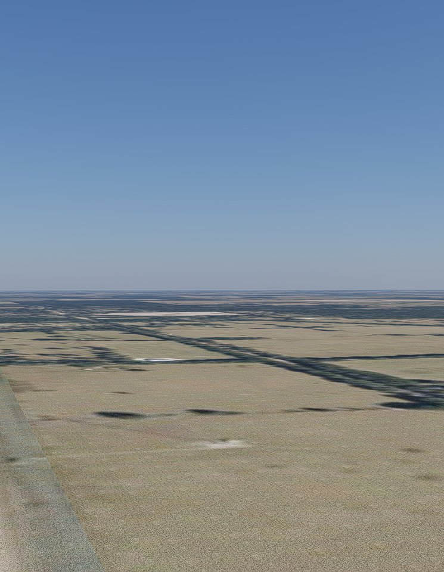
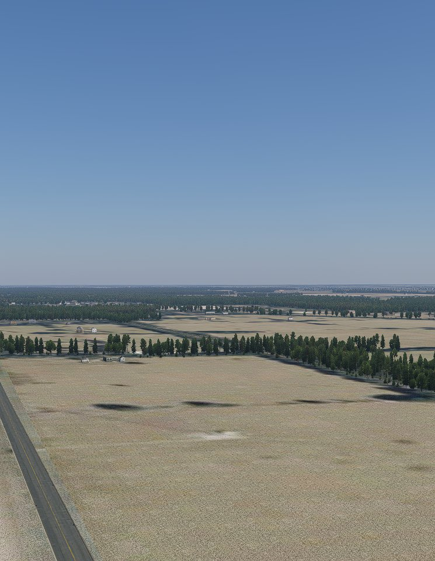
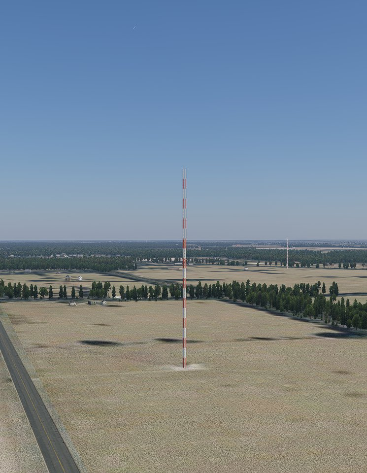
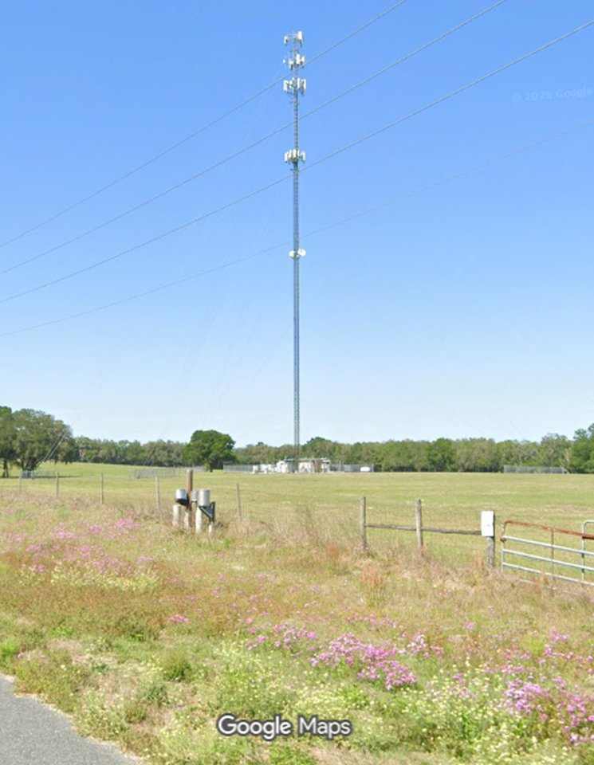
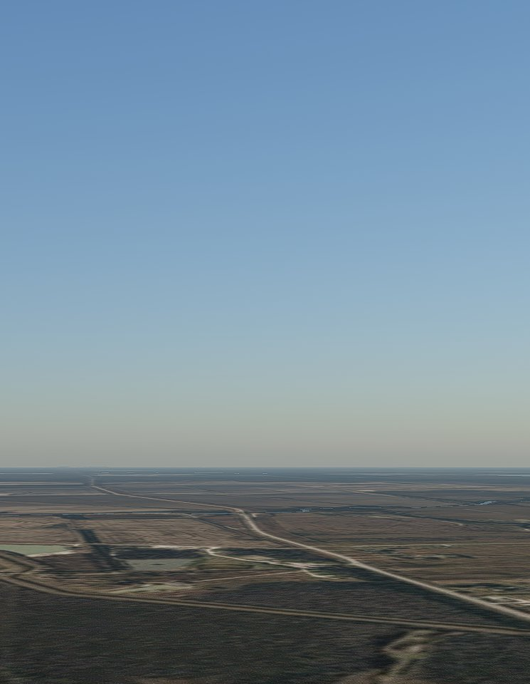
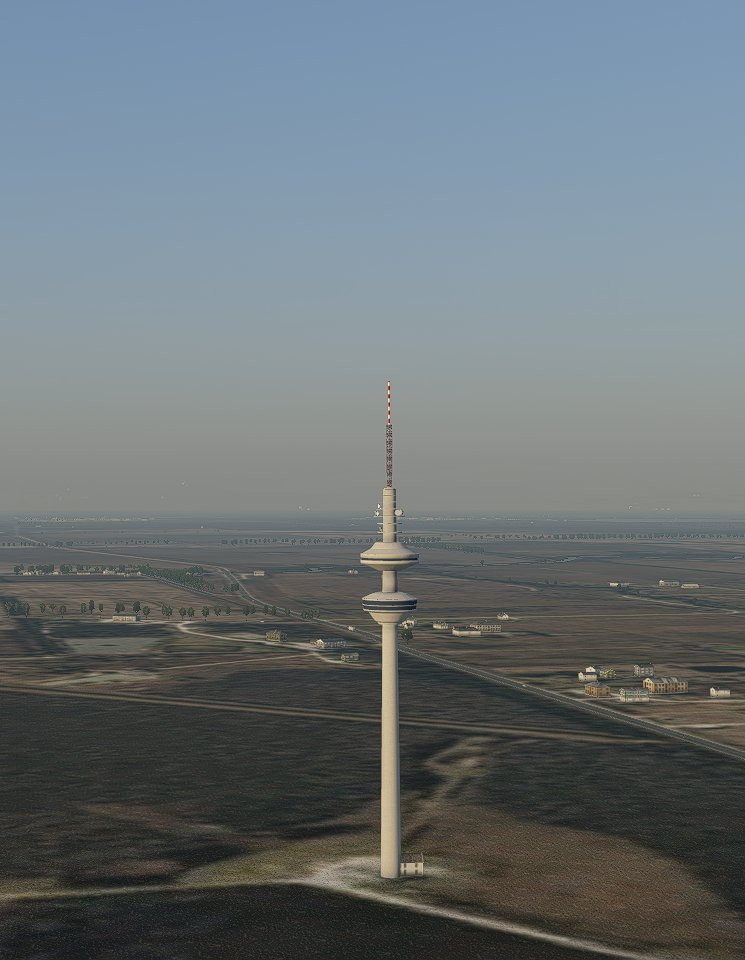
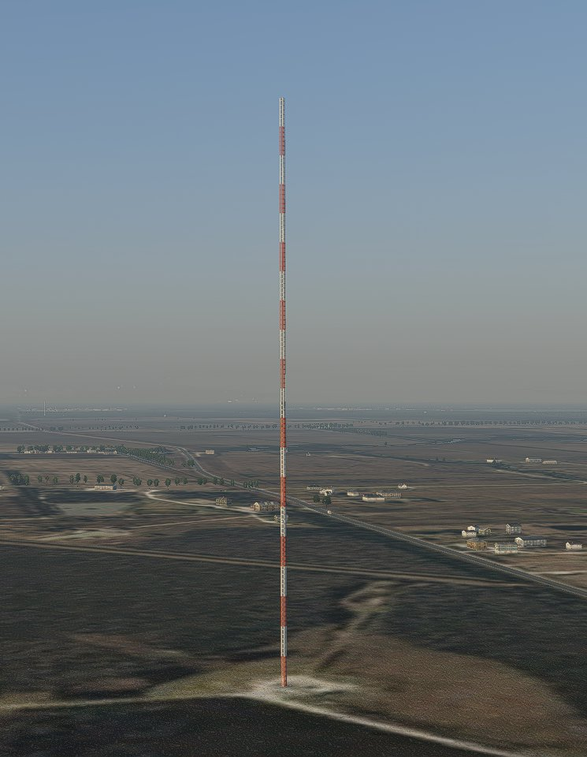
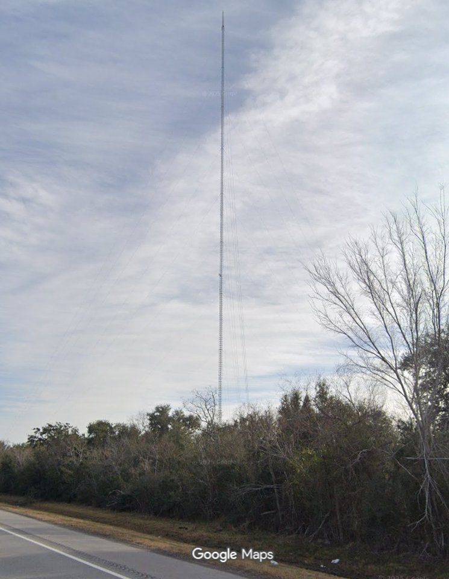

# FCC Towers for X-Plane 12

**FCC_Towers** is an X-Plane 12 scenery pack that draws the antenna
structures in the FCC's **Antenna Structure Registration (ASR)** database at
their real-world locations, at realistic heights and silhouettes. VFR pilots
get the same towers — in the same places — that are charted on VFR
sectionals, so they can be seen, reported, and avoided.

- ~155,000 towers across the United States (~1,100 regions, ~16 MB of DSF)
- Red/white lattice radio towers, grey monopole cell towers, and
  comm-style masts, chosen by FCC structure type and height
- Exclusion zones so SimHeaven/X-World Pro, autogen, or any other
  lower-priority pack don't draw a second "imposter" tower at the same site
- One tower per FCC registration (no phantom duplicates at array sites)
- Generated grey monopole objects fill the gap where stock scenery has no
  monopole-style tower above 25 m

## See it in action

Two test sites, each from the same vantage point. Row 1: X-Plane
default scenery, then SimHeaven alone. Row 2: SimHeaven + FCC_Towers,
then reality.

**Morriston, FL** — a ~105 m tower in open farmland. Neither X-Plane's
default scenery nor SimHeaven alone draws anything here; with FCC_Towers,
the tall red/white tower appears (reality panel from the roadside, via
Google Maps):

| X-Plane default | SimHeaven alone |
|:---:|:---:|
|  |  |

| SimHeaven + FCC_Towers | Reality |
|:---:|:---:|
|  |  |

**Hitchcock, TX** — the 610 m guyed mast (reality panel from the road
beside it, via Google Maps):

| X-Plane default | SimHeaven alone |
|:---:|:---:|
|  |  |

| SimHeaven + FCC_Towers | Reality |
|:---:|:---:|
|  |  |

## Install (X-Plane 12)

1. Download the latest `FCC_Towers-<version>.zip` from the [GitHub
   releases](../../releases).
2. Unzip the `FCC_Towers` folder into `C:\X-Plane 12\Custom Scenery`.
3. **Pack order matters:** in
   `C:\X-Plane 12\Custom Scenery\scenery_packs.ini` (edit with X-Plane
   closed), the `FCC_Towers` entry must sit **above (before)** any
   SimHeaven / X-World Pro / similar overlay scenery. If it is listed below
   them, X-Plane silently fails to load our region files wherever both packs
   cover the same region — nothing is logged, the towers just don't appear.
4. Verify in flight. Tall, identifiable test towers:

   | Tower | Location | Lat / Lon |
   |---|---|---|
   | 610 m guyed mast | HITCHCOCK, TX | 29.30008, -95.11131 |
   | 610 m tower | ERA, TX | 33.48486, -97.41244 |
   | 609 m tower | STOWELL, TX | 29.69792, -94.40258 |

**Uninstall:** delete the `FCC_Towers` folder and remove its line from
`scenery_packs.ini`.

## Build from source

Requires Python 3 (standard library only — no pip installs) and Laminar's
[DSFTool](https://developer.x-plane.com/tools/xptools/) for the final
text→binary conversion. DSFTool may be on your PATH, passed with
`--dsftool <path>`, or built from the vendored source in this repo
(`sh tools/dsftool/build.sh` — see [tools/dsftool/README.md](tools/dsftool/README.md)
for platforms and prebuilt download links).

```shell
python fcc_towers.py
```

That's the whole build: it downloads the current FCC registration data
(~38 MB, cached in `tmp\`), writes `active_antennas.csv`, and produces the
pack in `output\FCC_Towers\`. Copy that folder into
`C:\X-Plane 12\Custom Scenery` as above.

A few useful options (see `python fcc_towers.py -h` for all):

```shell
python fcc_towers.py --state TX,CA          :: only certain states
python fcc_towers.py --min-height 100       :: only tall structures (m)
python fcc_towers.py --radio-only           :: lattice radio towers only
python fcc_towers.py --exclude-radius-ft 500
python fcc_towers.py --dry-run              :: report the plan, write nothing
python fcc_towers.py --no-download          :: reuse the cached FCC zip

python fcc_towers.py csv                    :: download + write the CSV only
```

The FCC refreshes this data weekly, so rebuilding occasionally picks up
additions and changes.

## Object showroom (optional)

A test gallery of every antenna object style the pack can use, at true
heights on a white plinth (platform) north of Akron, CO — handy for
judging styles and heights in flight:

```shell
python fcc_towers.py showroom
```

Copy the resulting `output\FCC_TowerShowroom` folder into
`C:\X-Plane 12\Custom Scenery` (as with the main pack).

Depart **KAKO (Akron/Colorado-Yampa)** and fly **north** ~8 nm; the white
plinth with the object grid appears over the fields. Fly low (~a few hundred
ft AGL) to judge the short rows. Remove the folder (and its
`scenery_packs.ini` line) when done. Layout and rationale are in
[DESIGN.md](DESIGN.md).

## Frequently Asked Questions

### How does this work?
The Python code fetches the tower information from the FCC and generates DSF files
containing object references to (mostly) tower objects in the default X-Plane library.
The DSF file also contains exclusion zones around the base of each tower to prevent
other scenery overlays (e.g., SimHeaven) or X-Plane autogen from drawing towers in the same place.

The Python script is executed once to create the pack and the pack is then copied into
the X-Plane Custom Scenery directory.

### What if I don't see any towers?
The entry for this pack in `scenery_packs.ini` is probably in the wrong place.
It needs to be placed before the entries for other packs like SimHeaven.
SimHeaven takes over object generation completely by creating exclusion zones
over the entire tile, preventing object injection by any pack placed after it in the file.

### Will this tank my framerate?
Probably not.
There are usually not very many towers in view at one time.
If you suspect that the towers are impacting your framerate severely,
you can rebuild the scenery pack with the `--radio-only` option to
get only the taller lattice radio towers and omit the shorter and
numerous communications (cell) towers.

### Is this "vibe-coded AI slop"?
Not at all!
Although AI-assistance is heavily used in the project.
The human with 40+ years of software development experience teamed up with AI
to create this, working primarily as peers with the human directing the overall plan.
The AI performed most of the coding and performed extensive validation and testing
throughout the project.
Since the end result is a benign X-Plane 12 scenery pack, there is no risk in using
this pack as the worst that can happen is X-Plane stopping due to some error in the pack.
The Python script is also easily checked for any suspicious code.

### How does this compare to similar products by Taburet?
The author did not purchase these products and didn't use any assets from them.
It is likely that these products were created in a similar manner and provide
some additional "value-add" by including some higher-quality antenna models that are
better than the X-Plane stock models or any models provided here.

## Repository layout

| Path | What it is |
|---|---|
| `fcc_towers.py` | The whole program (Python 3, standard library only) |
| `additional_sites.csv` | Curated supplement for towers missing from FCC data (WWV/WWVB) |
| `showroom_antennas.csv` | The showroom object grid (regenerated by the `showroom` command) |
| `objects/` | Generated grey monopole meshes + texture, shipped in the pack |
| `docs/images/` | The "See it in action" comparison screenshots |
| `tools/gen_monopole.py` | Regenerates `objects/` |
| `tools/dsftool/` | Vendored Laminar xptools source (build DSFTool on Linux/macOS) |
| `doc/` | FCC ASR reference PDFs and DSF format documentation |
| `tests/` | Test suite (77 tests); CI runs it and builds the release pack |
| `tmp/` | Local cache (downloads, staging) — gitignored |

## Further reading

- [DESIGN.md](DESIGN.md) — how it works and why: data source and filters,
  object selection and variant rotation, exclusion zones, dedup, additional
  sites, showroom, DSFTool notes
- [doc/](doc/) — FCC ASR public-access documentation and the DSF spec/usage
- [tools/dsftool/README.md](tools/dsftool/README.md) — building DSFTool
